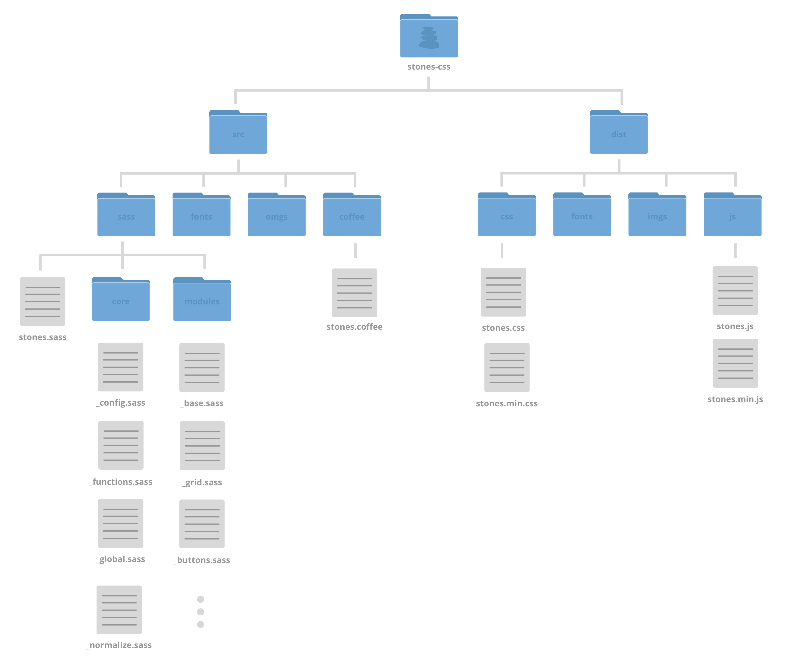

Stones
======

Modular front-end framework built in Sass (and Coffee)

<p align="center">
  
</p>
<p align="center">
  <a href="http://michaelgenesini.github.io/stones">Demo</a>
</p>


## Requirements

**Requires Sass, which can be installed with** `gem install sass`

**Requires Grunt Cli, which can be installed with** `sudo npm install -g grunt-cli`


## Installation
```
$ npm install
$ grunt server
```

## Template layout



#### Author
Michael Genesini
